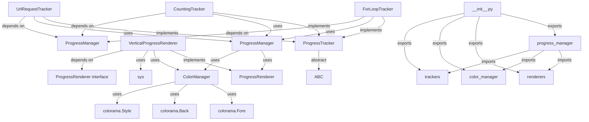

# 📊 ProgressVertical

**ProgressVertical** é uma biblioteca Python **em desenvolvimento** para a exibição de barras de progresso **verticais** em aplicações de linha de comando (CLI).

Projetada com foco em **usabilidade** e **personalização**, permite criar animações de progresso multi-etapas com:
- Cores.
- Ajustável.
- Inspiração na biblioteca [progressbar](https://pypi.org/project/progressbar/)

**Dinamismo e clareza visual**!

---
fluxograma:



ㅤ
---
 ProgressVertical requer Python 3.10 ou superior para funcionar corretamente.

A biblioteca foi desenvolvida e testada em versões recentes do Python, aproveitando recursos que não estão disponíveis em versões mais antigas, como melhorias de performance, novas funcionalidades da linguagem e melhor compatibilidade com dependências modernas.

> ⚠️ Importante: versões do Python anteriores à 3.10 podem causar erros inesperados ou impedir o funcionamento da biblioteca.


### 📦 Instalação

> pip install progressvertical


## Exemplo de Uso
Exemplo 1 – Múltiplas listas com rótulos e barras de colores diversificadas.

```python
from progressvertical import ProgressManager, VerticalProgressRenderer, ColorManager

ColorManager.init_colorama()
renderer = VerticalProgressRenderer(height=5,spacing=5)
manager = ProgressManager(renderer)

name_list = ["Mel", "Bianca", "Melissa","Piqueno","Netuno","Merenga"]
numbers_list = [10, 20, 30, 40, 50]
color_list = ["red", "green", "blue", "yellow"]


print("starting")

for name in manager.track(name_list, label="Names", fore_color="ciano"): __import__('time').sleep(0.4)
for number in manager.track(numbers_list, label="Number", fore_color="green"): __import__('time').sleep(0.3)
for color in manager.track(color_list, label="Color", fore_color="magenta"): __import__('time').sleep(0.2)
print("finished")
 


```

 


[](https://pypi.org/project/progressvertical/)
[](https://opensource.org/licenses/MIT)
